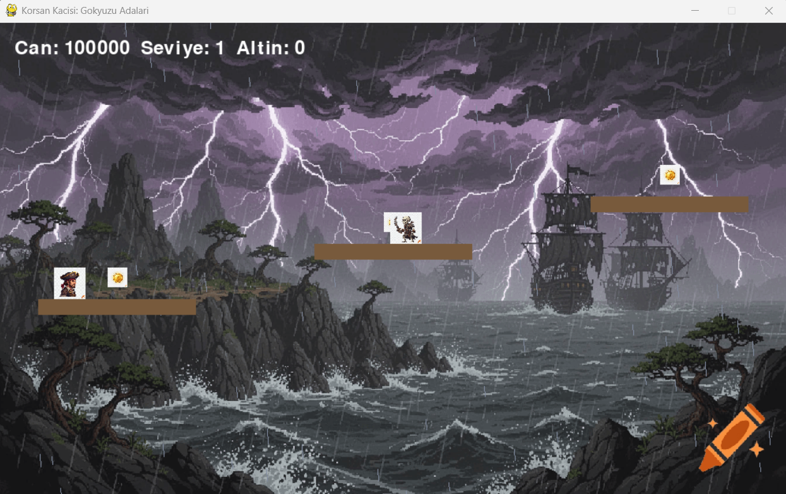
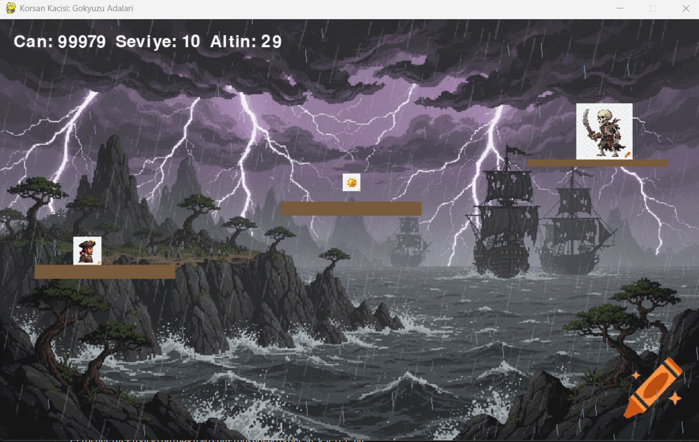

# 🏴‍☠️ Korsan Kaçışı: Gökyüzü Adaları

## 🎮 Oyun Hakkında

**Korsan Kaçışı: Gökyüzü Adaları**, Python ve Pygame kullanılarak geliştirilmiş 2 boyutlu bir platform oyunudur.

Oyuncu, gökyüzündeki adalarda ilerleyerek düşmanlardan kaçmalı, altınları toplamalı ve son bölümde Boss'u geçerek oyunu tamamlamalıdır.

---

## ✨ Özellikler

- 🏝️ 10 farklı seviye
- 👾 Hareket eden düşmanlar
- 👑 Son bölümde Boss savaşı
- 🪙 Altın toplama sistemi
- 🌧️ Yağmur efekti
- 💥 Patlama animasyonları
- ⏱️ Süreli oyun modu
- 🏆 Liderlik tablosu
- 🖼️ PNG ve WEBP görsel desteği

---

## 🎯 Kontroller

| Tuş | Görev |
|------|-------|
| A | Sola Git |
| D | Sağa Git |
| SPACE | Zıpla |

---

## 🛠️ Kullanılan Teknolojiler

- Python 3
- Pygame
- JSON
- OS
- Random
- Time

---

## 📂 Proje Yapısı

```
Korsan-Kacisi/
│
├── assets/
│   ├── player.png
│   ├── enemy.png
│   ├── background.png
│   ├── coin.png
│
├── leaderboard.json
├── main.py
└── README.md
```

---

## 🚀 Oyunu Çalıştırma

### Gerekli Kütüphane

```bash
pip install pygame
```

### Oyunu Başlat

```bash
python main.py
```

---

## 📸 Ekran Görüntüleri

### Ana Menü


### Oyun İçi



### Boss Bölümü




---

## 💡 Gelecekte Eklenebilecek Özellikler

- 🔊 Ses efektleri
- 🎵 Arka plan müziği
- ❤️ Gerçek can barı
- 💾 Kayıt sistemi
- 🏹 Yeni silahlar
- 🏝️ Yeni haritalar
- 🎮 Gamepad desteği

---

## 👨‍💻 Geliştirici

**Yusuf**

Bu proje Python ve Pygame öğrenme amacıyla geliştirilmiştir.

---

## ⭐ Eğer projeyi beğendiyseniz

Bu depoya ⭐ vermeyi unutmayın!

Teşekkürler! ❤️
